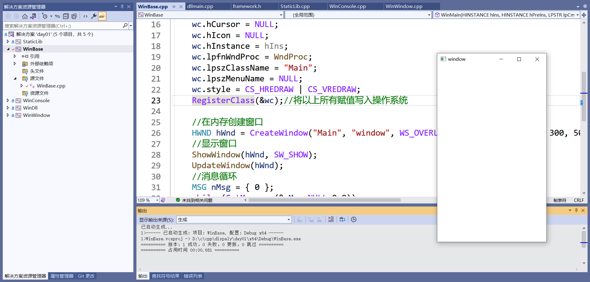

# DispalyAgent 学习过程记录

## day01

> 项目创建
>
> * 

> ？ error LNK2019: 无法解析的外部符号 main，函数 "int __cdecl invoke_main(void)" (?invoke_main@@YAHXZ) 中引用了该符号
>
> * 解决办法 https://blog.csdn.net/kieson_uabc/article/details/109672682

>* 项目字符集（★）
>
>

运行结果

> Q:窗口关闭后进程并未结束

