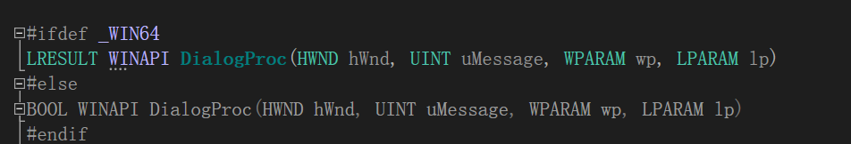
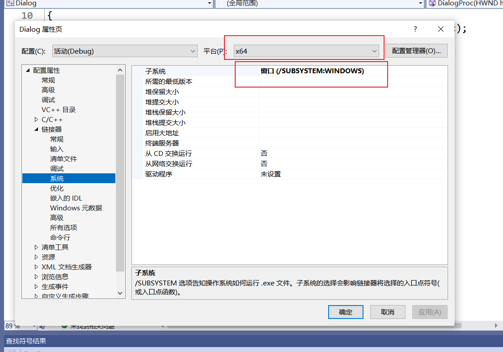
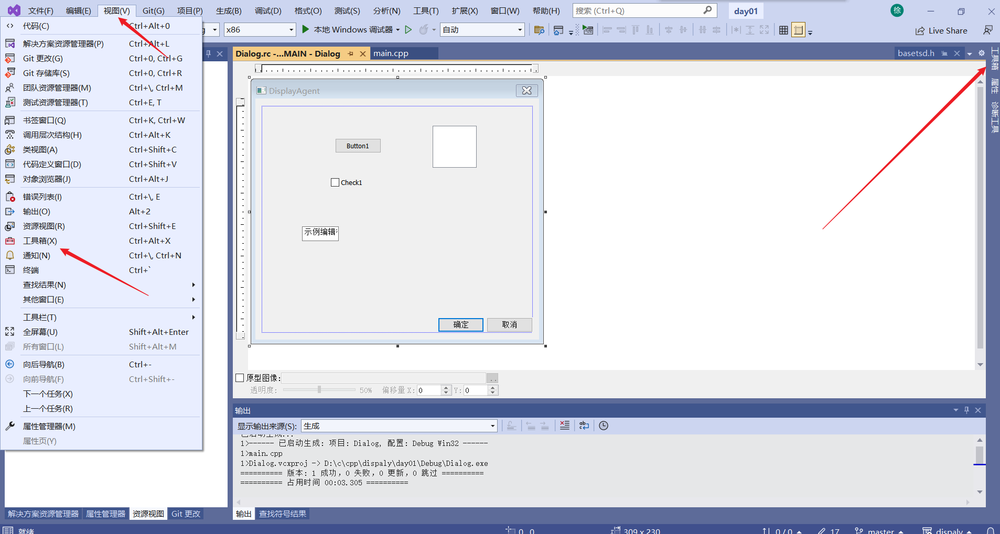
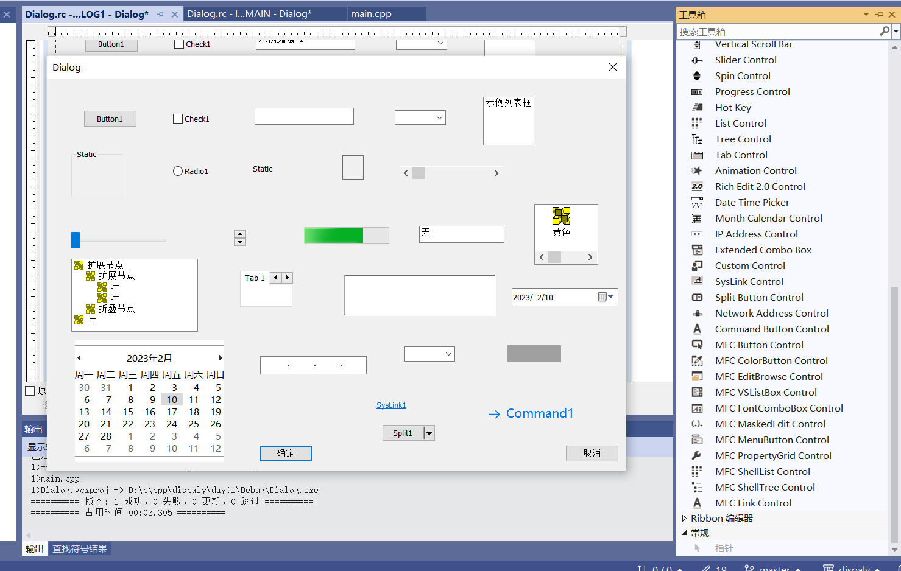
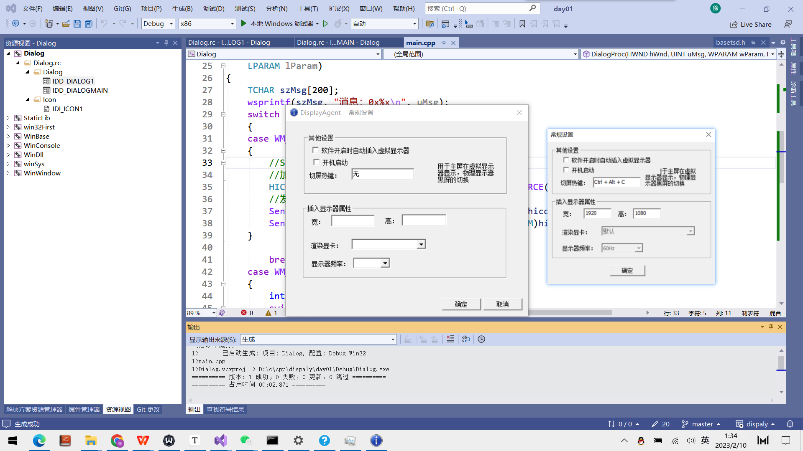

# dispalyAgent学习记录

* WinBase


* 字符集问题 解决办法https://blog.csdn.net/kieson_uabc/article/details/109672682

  

Q：窗口关闭后，进程并未结束

## 字符编码

## 窗口

> * 注册窗口类
> * 窗口创建

## 消息

> * 消息基础
> * 创建消息


# 项目问题



```c
BOOL CALLBACK DialogProc(HWND hWnd,
	UINT uMsg,
	WPARAM wParam,
	LPARAM lParam);
```

64位返回值用 LRESULT ,32位用BOOL

> 


Dialog

> 



* 2023.2.10
* 

> 目前只是一个静态界面