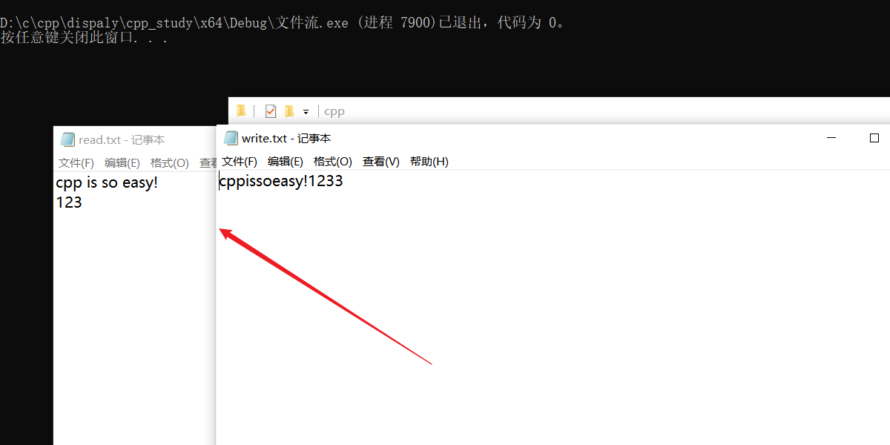

# dispalyAgent学习记录

* WinBase


* 字符集问题 解决办法https://blog.csdn.net/kieson_uabc/article/details/109672682

  

Q：窗口关闭后，进程并未结束

## 字符编码

## 窗口

> * 注册窗口类
> * 窗口创建

## 消息

> * 消息基础
> * 创建消息

## 模态框和非模态框

> https://blog.csdn.net/mpp_king/article/details/79902755
>
> 模态弹框和非模态弹框最大的区别就是是否强制用户交互。模态弹框会打断用户的当前操作流程，用户不在弹框上操作的话，其余功能都使用不了。从这方面，我们可以看出来模态弹框的优缺点都十分的明显：优点是可以很好的获取的用户的视觉焦点，缺点是打断了用户的当前操作流程。模态弹框属于一种重量性反馈，一般用于用户进行重要的操作。

# 项目问题


```c
BOOL CALLBACK DialogProc(HWND hWnd,
	UINT uMsg,
	WPARAM wParam,
	LPARAM lParam);
```

64位返回值用 LRESULT ,32位用BOOL

> 


Dialog

> 


* 2023.2.10
* 

> 目前只是一个静态界面


# cpp_study

## 文件流

```c++
#include<iostream>
#include<fstream>
using namespace std;

void asciiReadWriteFile(const char* readFileName, const char* writeFileName)
{
	fstream read(readFileName, ios::in);
	fstream write(writeFileName, ios::out);
	//1.注意：会忽略空格和换行
	/*while (!read.eof())
	{
		char key;
		read >> key;
		write << key;
	}*/

	//2.get() put()读写
	while (!read.eof())
	{
		char key;
		read.get(key);
		write.put(key);
	}
	read.close();
	write.close();
}

//二进制形式读写文件
void binaryReadWrite(const char* readFileName, const char* writeFileName)
{
	fstream readObj(readFileName, ios::in | ios::binary);
	fstream writeObj(writeFileName, ios::out | ios::binary);
	while (!readObj.eof())
	{
		char str[1024] = "";
		readObj.read(str, 1024);
		writeObj.write(str, 1024);
	}
	readObj.close();
	writeObj.close();
}

//文件指针移动
void seekReadFile(const char* fileName)
{
	fstream fread(fileName, ios::in);
	if (!fread) {
		cout << "open err" << endl;

	}
	fread.seekg(3);
	char key = fread.get();
	cout << key << endl;
	fread.seekg(1, ios::beg);//相对开始位置偏移一个
	cout << (char)fread.get() << endl;
}
int main()
{
	//打开文件测试
	fstream file("xx.txt", ios::in | ios::out | ios::trunc);
	if (!file || !file.is_open())
	{
		cerr << "文件打开失败" << endl;
	}
	file.close();
	
	//读写文件
	//asciiReadWriteFile("read.txt", "write.txt");

	binaryReadWrite("aa.txt", "bb.txt");

	//文件指针移动
	seekReadFile("seek.txt");
	return 0;
}
```





## C++读取配置文件的几种方法

>[C++读取配置文件的几种方法_零点零一的博客-CSDN博客_c++读取配置文件](https://blog.csdn.net/thanklife/article/details/52953475)

```c++
#include <iostream>
#include <fstream>
#include <map>
#include <string>

class ConfigFile {
public:
    ConfigFile(const std::string &filename) : m_filename(filename) {}
    bool load();
    bool save();
    std::string getValue(const std::string &key) const;
    void setValue(const std::string &key, const std::string &value);

private:
    std::string m_filename;
    std::map<std::string, std::string> m_values;
};

bool ConfigFile::load() {
    std::ifstream file(m_filename);
    if (!file.is_open()) {
        return false;
    }
    std::string line;
    while (std::getline(file, line)) {
        size_t pos = line.find('=');
        if (pos != std::string::npos) {
            std::string key = line.substr(0, pos);
            std::string value = line.substr(pos + 1);
            m_values[key] = value;
        }
    }
    file.close();
    return true;
}

bool ConfigFile::save() {
    std::ofstream file(m_filename);
    if (!file.is_open()) {
        return false;
    }
    for (const auto &pair : m_values) {
        file << pair.first << "=" << pair.second << std::endl;
    }
    file.close();
    return true;
}

std::string ConfigFile::getValue(const std::string &key) const {
    auto it = m_values.find(key);
    if (it != m_values.end()) {
        return it->second;
    }
    return "";
}

void ConfigFile::setValue(const std::string &key, const std::string &value) {
    m_values[key] = value;
}

```

> 使用

```c++
int main() {
    ConfigFile config("config.ini");
    if (!config.load()) {
        std::cout << "Failed to load config file" << std::endl;
        return 1;
    }
    std::string value = config.getValue("key");
    std::cout << "Value of key: " << value << std::endl;
    config.setValue("key", "new value");
    if (!config.save()) {
        std::cout << "Failed to save config file" << std::endl;
        return 1;
    }
    return 0;
}

```

## [CJson开源库](https://www.bilibili.com/video/BV1z5411s7pk/)

# 资料

https://github.com/0voice

