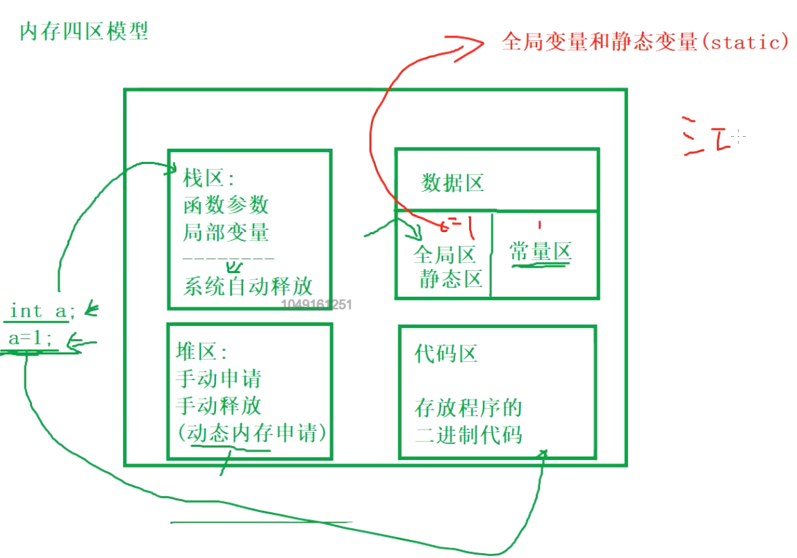
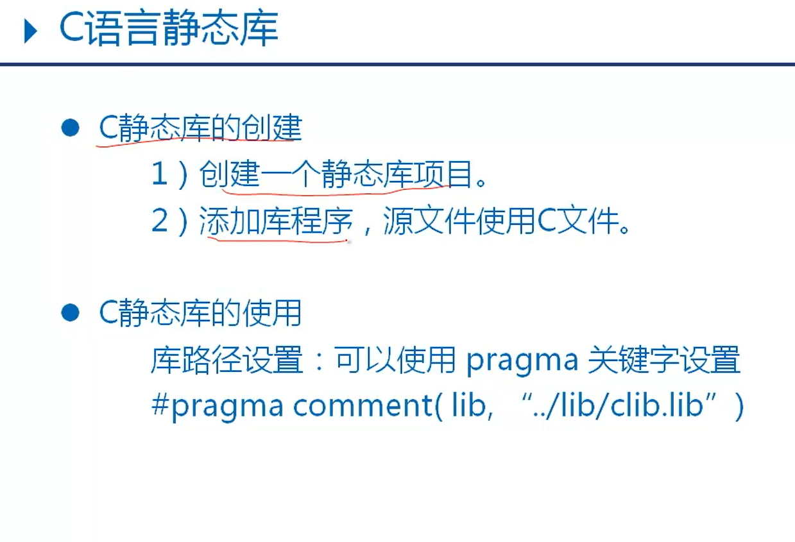
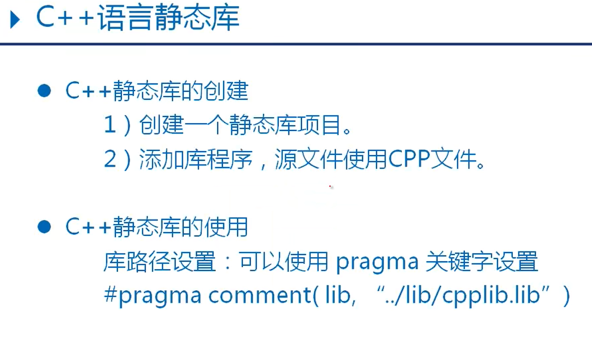

# 指针

## 内存四区



## 动态内存申请

malloc、calloc 、relloc

申请完后free(p)，p=NULL;


## 指针数组与数组指针

> 指针类型：去掉变量名
>
> int (*p)[2]  指针类型：int(\*)[]  
>
> 指针所指向类型：去掉变量名和*
>
> int (*p)[2] 指向类型 int[2]

## 二级指针与二维数组（难点，理解）


### 练习

* 迷宫编写
* 阶乘之和
* 比较字符串大小

# 静态库 动态库





## 静态库的使用

* 生成

  ```c++
  #include<iostream>
  
  using namespace std;
  //必须要声明
  int CPPlib_add(int a, int b);
  int CPPlib_sub(int a, int b);
  #pragma comment(lib,"../x64/Debug/CPPlib.lib")
  
  //c++调c库
  extern "C" int Clib_add(int a, int b);
  extern "C" int Clib_sub(int a, int b);
  #pragma comment(lib,"../x64/Debug/Clib.lib")
  int main()
  {
  	int sum = CPPlib_add(1, 2);
  	int sub = CPPlib_sub(2, 1);
  	cout << "sum=" << sum << "\tsub=" << sub << endl;
  
  	//c++调用c库
  	sum = Clib_add(4, 5);
  	sub = Clib_sub(6, 4);
  	cout << "sum=" << sum << "\tsub=" << sub << endl;
  	system("pause");
  	return 0;
  }
  ```

  